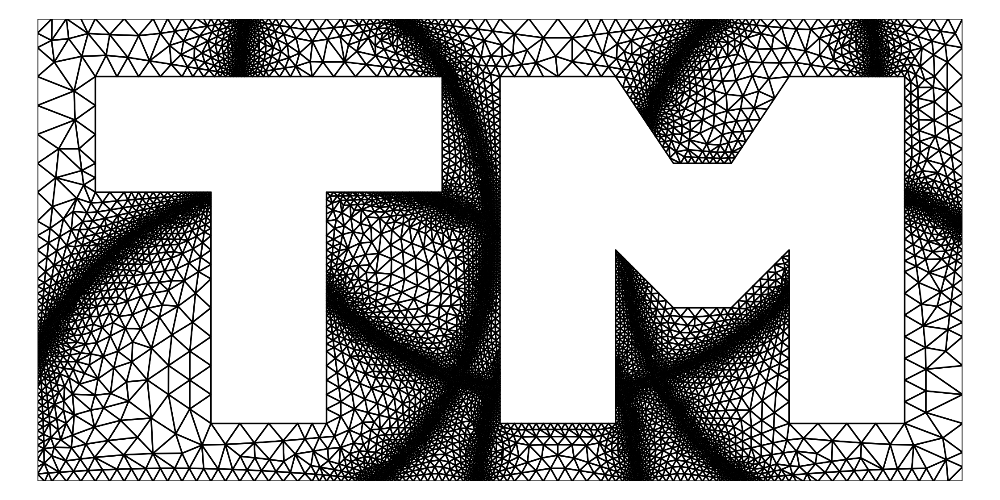
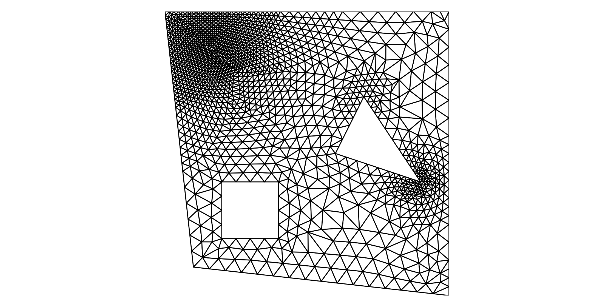

# TMesh
-----------------------------



**TMesh** is a small program to create two-dimensional triangular grids, which can 
be used for Finite Element Methods or Computational Fluid Dynamics applications.
The triangles are generated with an advancing-front method, for which the user must only provide edge segments that define the boundaries of the domain. Furthermore it is possible to refine 
triangles locally with a user-defined size function.

## Installation
**TMesh** is just base on the static library **libtmesh.a**, generated in the *lib*-directory of this repository. 
It is automatically created upon compilation with cmake.
For installation, just create a build directory and run
```sh
cmake ..
make install
```

## Usage of TMesh
**TMesh** takes a parameter-file as input for the mesh generation. Sample files are given in *share/files/*.
Basically, one only needs to define a few global parameters and the mesh boundaries in terms
of boundary nodes and edges. 
There is the possibility to assign markers to the boundaries and to each boundary-edge.
The only purpose of these markers is to identify these boundaries/edges later when the meshing is generated.
Here is a simple example to create a mesh using **TMesh**:
It is even possible to provide simple size function expressions through the input file.
```sh
#-----------------------------------------------------------
#                          TMESH
#-----------------------------------------------------------
Global element size: 0.5
Number of quadtree elements: 50
Mesh bounding box: -10.0, -10.0, 20.0, 20.0
Size function: 0.5-0.43*exp(-0.03*((1.-x)*(2.-x)+(9.-y)*(9.-y)))


#-----------------------------------------------------------
#                          NODES
#-----------------------------------------------------------
Define nodes:
1.0, 1.0
10.0, 0.0
10.0, 10.0
0.0,  10.0
2.0,  2.0
2.0,  4.0
4.0,  4.0
4.0,  2.0
6.0,  5.0
7.0,  7.0
9.0,  4.0
End nodes

#-----------------------------------------------------------
#                          BOUNDARIES
#-----------------------------------------------------------
# For every boundary an integer is assigned as marker.
# Boundary edges are defined by:
#
#     iStart, iEnd, edgeMarker, edgeRefinement
#
# > iStart and iEnd corresponds to the indices of the
#   nodes define above
# > edgeMarker is an integer that is assigned to the
#   respective edge
# > edgeRefinement is a double used to control the local
#   refinement near share edges (>0)
#
# > Exterior boundaries must be defined counter-clockwise
# > Interior boundaries must be defined clockwise
#
#-----------------------------------------------------------
Define exterior boundary: 1
0, 1, 0, 1.4
1, 2, 0, 1.4
2, 3, 0, 1.4
3, 0, 0, 1.4
End exterior boundary

Define interior boundary: 1
4, 5, 1, 1.6
5, 6, 1, 1.6
6, 7, 1, 1.6
7, 4, 1, 1.6
End interior boundary

Define interior boundary: 2
8, 9, 2, 1.5
9, 10, 2, 1.5
10, 8, 2, 1.5
End interior boundary
```

The mesh is created with 
```sh
./bin/TMesh example.para
```
Here is the generated mesh:


## Create a plot of your mesh
The python script `share/python/plot_mesh.py` can create simple mesh plots from TMesh's output.
Simply write TMesh's output to a text file 

```sh
./bin/TMesh example.para > your_mesh.txt
```

and then run the Python script with

```sh
python share/python/plot_mesh.py your_mesh.txt your_meshplot.png
```

## Usage of C-Functions
A detailed description on how to define a mesh is given in the examples under 
*src/tmesh/test*.

Every mesh is defined by an exterior boundary and several more interior boundaries.
These boundaries consist of edge segments, which connect two nodes.
Besides this, it is also necessary to provide a size-function `size_fun` to the mesh, which
defines the local element size in the domain.
First, create a new mesh object:
```sh
tmMesh *mesh = tmMesh_create(xy_min, xy_max, N, size_fun);
```
Here, `xy_min` and `xy_max` define the bounding box of the entire domain, `N` is the number of elements that are stored in the underlying quadtree structure until a quad is refined.
Next, define some vertices for the exterior boundary:
```sh
tmNode *n0 = tmNode_create(mesh, xy0);
tmNode *n1 = tmNode_create(mesh, xy1);
tmNode *n2 = tmNode_create(mesh, xy2);
```
`xy0`, `xy1`, `xy2` define the node coordinates, e.g. `tmDouble xy0[2] = { -1.0, -1.0 };`.
Now create the exterior boundary and add the edge segments to it.
**IMPORTANT**: Exteriror boundary edge segments must be defined in a **counter-clockwise** manner, such that all edge normals point to the inside of the domain.
```sh
tmBdry *bdry_ext = tmMesh_addBdry(mesh, FALSE, 0);
tmEdge *e0 = tmBdry_edgeCreate(bdry_ext, n0, n1, 0, 1.0);
tmEdge *e1 = tmBdry_edgeCreate(bdry_ext, n1, n2, 0, 1.0);
tmEdge *e2 = tmBdry_edgeCreate(bdry_ext, n2, n0, 0, 1.0);
```
Interior boundaries are defined in a similar manner, but the segments must be defined in  **clockwise** direction. 
```sh
tmNode *n3 = tmNode_create(mesh, xy3);
tmNode *n4 = tmNode_create(mesh, xy4);
tmNode *n5 = tmNode_create(mesh, xy5);

tmBdry *bdry_int = tmMesh_addBdry(mesh, TRUE, 1);
tmEdge *e3 = tmBdry_edgeCreate(bdry_int, n3, n4, 1, 1.0);
tmEdge *e4 = tmBdry_edgeCreate(bdry_int, n4, n5, 1, 1.0);
tmEdge *e5 = tmBdry_edgeCreate(bdry_int, n5, n3, 1, 1.0);
```
Finally, the advancing-front meshing is performed using
```sh
tmMesh_ADFMeshing(mesh);
```
The final mesh can be printed to the command line with
```sh
tmMesh_printMesh(mesh);
```
and the output of this function can be rendered with a small Python script **plot_mesh.py**,
which is located in the directory *share/python*.


### Custom Element Sizing
The local element size can either be defined through a size function defined by the user or  
by the boundary edges. Elements near sharp angles are automatically refined.


## Benchmarks


**TMesh** uses an adaptive quadtree structure to store vertices, edges and triangles in an accessible way. This allows to find any existing object in the meshing process with an average complexity of N log.
The quadtree is refined and coarsened automatically as objects are inserted or removed from the structure. 

For profiling of a test-binary:
* Compile with `-pg` (default in debugging mode)
* Run the test binary 
* Profile with: `gprof test gmon.out > prof_output`

 ### Qtree search benchmark
 Here's a short benchmark of the underlying quadtree structure. Its the output from the test-function `test_tmQtree_performance()` for various numbers of vertices.
| Nodes        | Qtree        | Brute Force  |
| :----------: | :----------: | :----------: |
|        10000 |        0.0 s |        0.6 s |
|        20000 |        0.1 s |        2.6 s |
|        30000 |        0.3 s |        8.2 s |
|        50000 |        0.8 s |       38.4 s |
|       100000 |        3.5 s |      371.7 s |


### Triangular mesh generation benchmark
This plot shows the performance of **TMesh** for the generation of to simple meshes, 
defined in the test function `test_tmFront_simpleMesh2()` and `test_tmBdry_sizeFun()`.


## Todos
* Python-Interface 
* Delaunay-refinement for generated grids
* Better output format of generated meshes, e.g. HDF5 or netCDF.

## Used Libraries 
* [The Better String Library](http://bstring.sourceforge.net)
* [TinyExpr](https://github.com/codeplea/tinyexpr)
* Some snippets from Zed Shaw's [Learn C the hard way](https://github.com/zedshaw/learn-c-the-hard-way-lectures)

## Sources
* o'Rourke, Joseph. Computational geometry in C. Cambridge university press, 1998.
* [Shewchuk, Jonathan R. Lecture Notes on Delaunay Mesh Generation, February 5, 2012](https://people.eecs.berkeley.edu/~jrs/meshpapers/delnotes.pdf)
* [Jonathan R. Shewchuk's free course material on Mesh Generation and Geometry Processing in Graphics, Engineering, and Modeling ](https://people.eecs.berkeley.edu/~jrs/mesh/)
* Lo, Daniel SH. Finite element mesh generation. CRC Press, 2014
* Blazek, Jiri. Computational fluid dynamics: principles and applications. Butterworth-Heinemann, 2015
* Zed A. Shaw, Learn C the Hard Way (this is where the testing structure and the list functions are coming from)

## License 
The project is licensed under the MIT License - see the LICENSE file for details.
