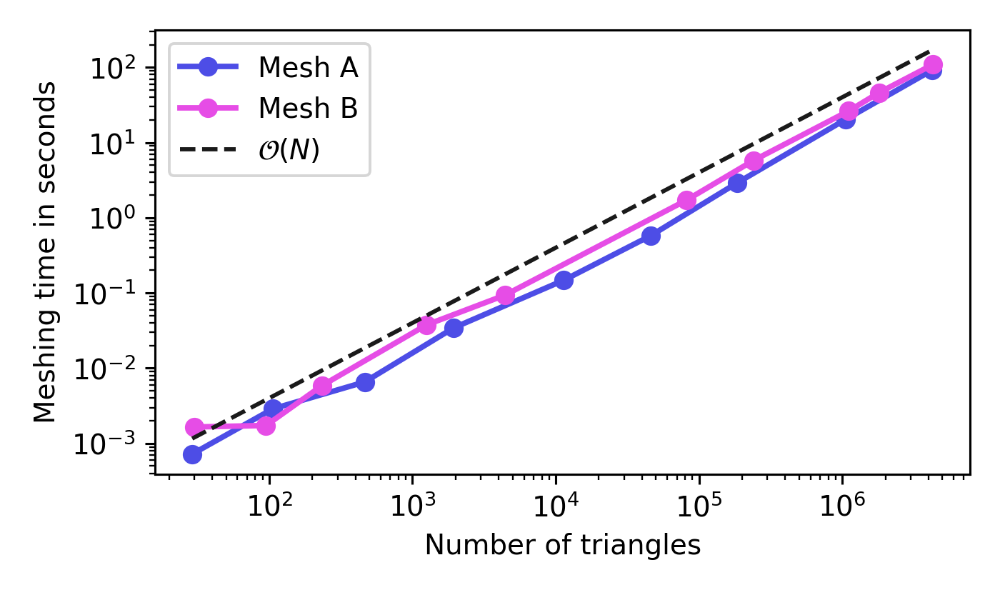

# TMesh
-----------------------------


**TMesh** is a lightweight C library to create two-dimensional triangular grids, which can 
be used for Finite Element or Computational Fluid Dynamics applications.
The triangles are generated with an advancing-front method, for which the user must only provide edge segments that define the boundaries of the domain. Furthermore it is possible to refine 
triangles locally with a user-defined size function.

## Installation
Currently, **TMesh** is just a static library **libtmesh.a**, generated in the *lib*-directory of this repository. It relies on my static **liblcthw.a** library, which is created here as well. 
For installation, just create a build directory and run
```sh
cmake ..
make install
```

## Handling
Every mesh is defined by an exterior boundary and several more interior boundaries.
These boundaries consist of edge segments, which connect two nodes.
Besides this, it is also necessary to provide a size-function `size_fun` to the mesh, which
defines the local element size in the domain.
First, create a new mesh object:
```sh
tmMesh *mesh = tmMesh_create(xy_min, xy_max, N, size_fun);
```
Here, `xy_min` and `xy_max` define the bounding box of the entire domain, `N` is the number of elements that are stored in the underlying quadtree structure until a quad is refined.
Next, define some vertices for the exterior boundary:
```sh
tmNode *n0 = tmNode_create(mesh, xy0);
tmNode *n1 = tmNode_create(mesh, xy1);
tmNode *n2 = tmNode_create(mesh, xy2);
```
`xy0`, `xy1`, `xy2` define the node coordinates, e.g. `tmDouble xy0[2] = { -1.0, -1.0 };`.
Now create the exterior boundary and add the edge segments to it.
**IMPORTANT**: Exteriror boundary edge segments must be defined in a **counter-clockwise** manner, such that all edge normals point to the inside of the domain.
```sh
tmBdry *bdry_ext = tmMesh_addBdry(mesh, FALSE, 0);
tmEdge *e0 = tmBdry_edgeCreate(bdry_ext, n0, n1, 0);
tmEdge *e1 = tmBdry_edgeCreate(bdry_ext, n1, n2, 0);
tmEdge *e2 = tmBdry_edgeCreate(bdry_ext, n2, n0, 0);
```
Interior boundaries are defined in a similar manner, but the segments must be defined in  **clockwise** direction. 
```sh
tmNode *n3 = tmNode_create(mesh, xy3);
tmNode *n4 = tmNode_create(mesh, xy4);
tmNode *n5 = tmNode_create(mesh, xy5);

tmBdry *bdry_int = tmMesh_addBdry(mesh, TRUE, 1);
tmEdge *e3 = tmBdry_edgeCreate(bdry_int, n3, n4, 1);
tmEdge *e4 = tmBdry_edgeCreate(bdry_int, n4, n5, 1);
tmEdge *e5 = tmBdry_edgeCreate(bdry_int, n5, n3, 1);
```
Finally, the advancing-front meshing is performed using
```sh
tmMesh_ADFMeshing(mesh);
```
The final mesh can be printed to the command line with
```sh
tmMesh_printMesh(mesh);
```
and the output of this function can be rendered with a small Python script **plot_mesh.py**,
which is located in the directory *share/python*.


## Benchmarks


**TMesh** uses an adaptive quadtree structure to store vertices, edges and triangles in an accessible way. This allows to find any existing object in the meshing process with an average complexity of N log.
The quadtree is refined and coarsened automatically as objects are inserted or removed from the structure. 

For profiling of a test-binary:
* Compile with `-pg` (default in debugging mode)
* Run the test binary 
* Profile with: `gprof test gmon.out > prof_output`

 ### Qtree search benchmark
 Here's a short benchmark of the underlying quadtree structure. Its the output from the test-function `test_tmQtree_performance()` for various numbers of vertices.
| Nodes        | Qtree        | Brute Force  |
| :----------: | :----------: | :----------: |
|        10000 |        0.0 s |        0.6 s |
|        20000 |        0.1 s |        2.6 s |
|        30000 |        0.3 s |        8.2 s |
|        50000 |        0.8 s |       38.4 s |
|       100000 |        3.5 s |      371.7 s |


### Triangular mesh generation benchmark
This plot shows the performance of **TMesh** for the generation of a simple mesh, 
defined in the test function `test_tmFront_simpleMesh2()`.



## Todos
* Python-Interface 
* Delaunay-refinement for generated grids
* Automatic generation of size-functions, based on the provided boundaries
* Better output format of generated meshes, e.g. HDF5 or netCDF.

## Sources
* [Jonathan Richard Shewchuk, Lecture Notes on Delaunay Mesh Generation, February 5, 2012](https://people.eecs.berkeley.edu/~jrs/meshpapers/delnotes.pdf)
* [Jonathan Richard Shewchuk's free course material on Mesh Generation and Geometry Processing in Graphics, Engineering, and Modeling ](https://people.eecs.berkeley.edu/~jrs/mesh/)
* Lo, Daniel SH. Finite element mesh generation. CRC Press, 2014
* Blazek, Jiri. Computational fluid dynamics: principles and applications. Butterworth-Heinemann, 2015
* Zed A. Shaw, Learn C the Hard Way (this is where liblcthw.a comes from)

## License 
MIT License

Copyright (c) 2020 Florian Setzwein

Permission is hereby granted, free of charge, to any person obtaining a copy of this software and associated documentation files (the "Software"), to deal in the Software without restriction, including without limitation the rights to use, copy, modify, merge, publish, distribute, sublicense, and/or sell copies of the Software, and to permit persons to whom the Software is furnished to do so, subject to the following conditions:

The above copyright notice and this permission notice shall be included in all copies or substantial portions of the Software.

THE SOFTWARE IS PROVIDED "AS IS", WITHOUT WARRANTY OF ANY KIND, EXPRESS OR IMPLIED, INCLUDING BUT NOT LIMITED TO THE WARRANTIES OF MERCHANTABILITY, FITNESS FOR A PARTICULAR PURPOSE AND NONINFRINGEMENT. IN NO EVENT SHALL THE AUTHORS OR COPYRIGHT HOLDERS BE LIABLE FOR ANY CLAIM, DAMAGES OR OTHER LIABILITY, WHETHER IN AN ACTION OF CONTRACT, TORT OR OTHERWISE, ARISING FROM, OUT OF OR IN CONNECTION WITH THE SOFTWARE OR THE USE OR OTHER DEALINGS IN THE SOFTWARE.


